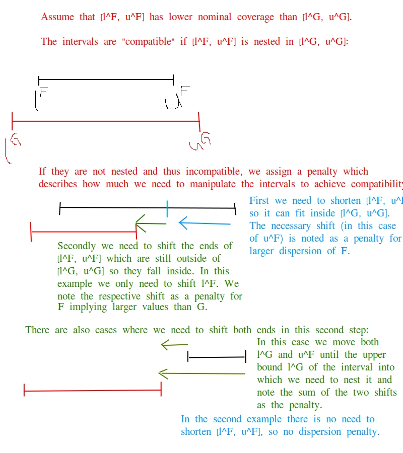

```{r setup, include=FALSE}
knitr::opts_chunk$set(echo = TRUE)
```

## Preliminaries

Consider two predictive distributions $F$ and $G$. Their *Cramer distance* or *integrated quadratic distance*  is defined as
$$
\text{CD}(F, G) = \int_{-\infty}^\infty(F(x) - G(x))^2 dx
$$
where $F(x)$ and $G(x)$ denote the cumulative distribution functions. The Cramer distance is the divergence associated with the continuous ranked probability score (Thorarinsdottir 2013, Gneiting and Raftery 2007)
$$
\text{CRPS}(F, y) = \int_{-\infty}^\infty(F(x) - \mathbf{1}(x \geq y))^2 dx,
$$
where $y$ denotes the observed value. Indeed, it is a generalization of the CRPS as it simplifies to the CRPS if one out of $F$ and $G$ is a one-point distribution. The Cramer distance is commonly used to measure the similarity of forecast distributions (see Richardson et al 2020 for a recent application).

Now assume that for each of the distributions $F$ and $G$ we only know $K$ quantiles at equally spaced levels $1/(K + 1), 2/(K + 1), \dots, K/(K + 1)$. Denote these quantiles by $q^F_1, \dots, q^F_K$ and $q^G_1, \dots, q^G_K$, respectively. It is well known that the CRPS can be approximated by an average of linear quantile scores (Laio and Tamea 2007, Gneiting and Raftery 2007):
\begin{equation}
\text{CRPS}(F, y) \approx \frac{1}{K} \times \sum_{k = 1}^K 2\{\mathbf{1}(y \leq q^F_k)\} \times (q^F_k - y).\label{eq:linear_quantile_scores}
\end{equation}
This approximation is equivalent to the weighted interval score (WIS) which is in use for evaluation of quantile forecasts at the Forecast Hub, see Section 2.2 of Bracher et al (2021). This approximation can be generalized to the Cramer distance as
\begin{equation}
\text{CD}(F, G) \approx \frac{1}{K(K + 1)}\sum_{i = 1}^K\sum_{j = 1}^K \mathbf{1}\{(i - j) \times (q^F_i - q^G_j) \leq 0\} \times \left| q^F_i - q^G_j\right|,\label{eq:approx_cd}
\end{equation}
This can be seen as a sum of penalties for \textit{incompatibility} of predictive quantiles. Whenever the predictive quantiles $q_i^F$ and $q_j^G$ are incompatible in the sense that they imply $F$ and $G$ are different distributions (e.g. because $q_F^i > q_G^j$ despite $i < j$ or $q_F^i \neq q_G^j$ despite $i = j$), a penalty $\left| q^F_i - q^G_j\right|$ is added to the sum. This corresponds to the shift which would be necessary to make $q_F^i$ and $q_G^j$ compatible.

## A divergence measure for central prediction intervals with potentially different nominal coverages

Consider two central prediction intervals $[l^F, u^F]$ and $[l^G, u^G]$ with nominal levels $\alpha^F$ and $\alpha^G$, respectively (meaning that $l^F$ is the $(1 - \alpha^F)/2$ quantile of $F$ etc). We can define an \textit{interval divergence} measure by comparing the two pairs of predictive quantiles and summing up the respective incompatibility penalties as in \eqref{eq:approx_cd}. Adapting notation to the interval formulation and structuring the sum slightly differently, this can be written as:

\begin{align*}
\text{ID}([l^F, u^F], [l^G, u^G], \alpha^F, \alpha^G) = & \ \mathbf{1}(\alpha^F \leq \alpha^G)\times\left\{\max(l^G - l^F, 0) + \max(u^F - u^G, 0)\right\} \ +\\
& \ \mathbf{1}(\alpha^F \geq \alpha^G) \times \left\{\max(l^F - l^G, 0) + \max(u^G - u^F, 0)\right\} \ +\\
& \max(l^F - u^G, 0) \ +\\
& \max(l^G - u^F, 0)
\end{align*}

The first row adds penalties for the case where $[l^F, u^F]$ should be nested in $[l^G, u^G]$, but at least one of its ends is more extreme than the respective end of $[l^G, u^G]$. The second row covers the converse case. The last two rows add penalties if the lower end of one interval exceeds the upper end of the other, i.e. the intervals do not overlap.

This can be seen as a (scaled version of a) generalization of the interval score, but writing out the exact relationship is a bit tedious.

We now define four auxiliary terms with an intuitive interpretation which add up to the interval divergence:

\begin{itemize}
\item The term
$$
D_F = \mathbf{1}(\alpha^F \leq \alpha^G)\times\max\{(u^F - l^F) - (u^G - l^G), 0\}
$$
is the sum of penalties resulting from $F$ being more dispersed than $G$. It is positive whenever the interval $[l^F, u^F]$ is longer than $[l^G, u^G]$, even though it should be nested in the latter. $D_F$ then tells us by how much we would need to shorten $[l^F, u^F]$ so it could fit into $[l^G, u^G]$.
\item The term
$$
D_G = \mathbf{1}(\alpha^G \leq \alpha^G)\times\max\{(u^G - l^G) - (u^F - l^F), 0\}
$$
measures the converse, i.e. overdispersion of $G$ relative to $F$.
\item The term
$$
S^F = \max\{\mathbf{1}(\alpha^G \leq \alpha^F) \times \max(l^F - l^G, 0) + \mathbf{1}(\alpha^F \leq \alpha^G) \times \max(u^F - u^G, 0) + \max(l^F - u^G, 0) - D_F - D_G, 0\}
$$
sums over penalties for values in $\{l^F, u^F\}$ exceeding those from $\{l^G, u^G\}$ where they should not (only counting penalties not already covered in $D_F$ or $D_G$). It thus represents an \textit{upward shift} of $F$ relative to $G$.
\item The term
$$
S^G = \max\{\mathbf{1}(\alpha^F \leq \alpha^G) \times \max(l^G - l^F, 0) + \mathbf{1}(\alpha^G \leq \alpha^F) \times \max(u^G - u^F, 0) + \max(l^G - u^F, 0) - D_G - D_F, 0\}
$$
accordingly represents an \textit{upward shift} of $G$ relative to $F$.
\end{itemize}

It can be shown that
$$
\text{ID}([l^F, u^F], [l^G, u^G], \alpha^F, \alpha^G) = D_F + D_G + S^F + S^G
$$
Intuitively the interval divergence measures by how much we need to move the quantiles of the interval with lower nominal coverage so it fits into the one with larger nominal coverage.

The following improvised drawing illustrates the intuition behind these terms:



## Approximating the Cramer distance using interval divergences

Assuming $K$ is even, the $K$ equally spaced predictive quantiles of each distribution can seen as $L = K/2$ central prediction intervals with coverage levels $\alpha_i = 2i/(L + 1), i = 1, \dots, L$. Similarly to the definition of the WIS, the approximation \eqref{eq:approx_cd} can also be expressed in terms of these intervals as
$$
\text{CD}(F, G) \approx \frac{1}{2L(2L + 1)}\sum_{k = 1}^L\sum_{m = 1}^L \text{ID}([l^F_k, u^F_k], [l^G_m, u^G_m], \alpha_k^F, \alpha_m^G).
$$
This implies a decomposition of the Cramer distance into the four interpretable components defined for the interval divergence in the previous section. If $G$ is a one-point distribution, the CD reduces to the WIS and the proposed decomposition reduces to the well-known decomposition of the WIS into dispersion, overprediction and underprediction components.

Note that in practice we usually have an uneven rather than even number $K$ of predictive quantiles. In this case the median needs to be treated separately (comparisons of the ``0% prediction interval'' need to be weighted down with a factor of 2; this is the same little quirk as the one identified by Ryan and Evan for the WIS a few months ago).

The decomposition has the following properties:

\begin{itemize}
\item Additive shifts of the two distributions only affect the shift components, not the dispersion components.
\item Consequently, if $G$ and $G$ are identical up to an additive shift, both dispersion components will be 0.
\item If $F$ and $G$ are both symmetric and have the same median, the both shift components will be 0.
\item I think that in general it is possible that both shift components or both dispersion components are greater than 0, which leads to a somewhat strange interpretation. But this should only concern constructed examples.
\end{itemize}

## Implementation in R

A Shiny app to play around with the Cramer distance and its decomposition is available at https://jobrac.shinyapps.io/app_cramer_distance/

```{r}
# Somewhat patchy functions to compute the approximate CD and its decomposition:

# helper function to evaluate interval divergence:
interval_comparison <- function(l_F, u_F, alpha_F, l_G, u_G, alpha_G){
  # if both PIs have same level
  if(alpha_F == alpha_G){
    F_disp <- max((u_F - l_F) - (u_G - l_G), 0)
    G_disp <- max((u_G - l_G) - (u_F - l_F), 0)
    F_larger <- max(max(u_F - u_G, 0) + max(l_F - l_G, 0) + 
                      max(l_F - u_G, 0) - F_disp - G_disp, 0)
    G_larger <- max(max(u_G - u_F, 0) + max(l_G - l_F, 0) + 
                      max(l_G - u_F, 0) - F_disp - G_disp, 0)
  }
  # if F has lower nominal coverage and "should" be nested in G:
  if(alpha_F < alpha_G){
    F_disp <- max((u_F - l_F) - (u_G - l_G), 0)
    G_disp <- 0
    F_larger <- max(max(u_F - u_G, 0) + max(l_F - u_G, 0) - F_disp, 0)
    G_larger <- max(max(l_G - l_F, 0) + max(l_G - u_F, 0) - F_disp, 0)
  }
  # if G has lower nominal coverage and "should" be nested in F:
  if(alpha_G < alpha_F){
    G_disp <- max((u_G - l_G) - (u_F - l_F), 0)
    F_disp <- 0
    G_larger <- max(max(u_G - u_F, 0) + max(l_G - u_F, 0) - G_disp, 0)
    F_larger <- max(max(l_F - l_G, 0) + max(l_F - u_G, 0) - G_disp, 0)
  }
  
  id <- F_larger + G_larger + F_disp + G_disp
  
  return(list(id = id,
              F_larger = F_larger,
              G_larger = G_larger,
              F_disp = F_disp,
              G_disp = G_disp))
}

# function to compute CD and its decomposition:
approx_cd <- function(q_F, q_G){
  # compute quantile levels from length of provided quantile vectors:
  K <- length(q_F)
  if(length(q_G) != K) stop("q_F and q_G need to be of the same length")
  p <- (1:K)/(K + 1) # function assumes that the quantile levels are equally spaced
  coverages <- 2*(1:(K/2))/(K + 1)
  
  n_intervals <- K/2  
  # matrices to store interval divergences and components:
  matrix_interval_comparisons <-
    matrix_F_larger <- matrix_G_larger <-
    matrix_F_disp <- matrix_G_disp <-
    matrix(NA, ncol = n_intervals, nrow = n_intervals,
           dimnames = list(paste("F", 1:n_intervals), paste("G", 1:n_intervals)))
  
  # fill these matrices:
  for(i in 1:n_intervals){
    for(j in 1:n_intervals){
      i_comp <- interval_comparison(l_F = q_F[i], u_F = q_F[K + 1 - i], 
                                    alpha_F = p[K + 1 - i] - p[i],
                                    l_G = q_G[j], u_G = q_G[K + 1 - j], 
                                    alpha_G = p[K + 1 - j] - p[j])
      matrix_interval_comparisons[i, j] <- i_comp$id
      matrix_F_larger[i, j] <- i_comp$F_larger
      matrix_G_larger[i, j] <- i_comp$G_larger
      matrix_F_disp[i, j] <- i_comp$F_disp
      matrix_G_disp[i, j] <- i_comp$G_disp
    }
  }
  
  cd <- 2*sum(matrix_interval_comparisons)/K/(K + 1)
  F_larger <- 2*sum(matrix_F_larger)/K/(K + 1)
  G_larger <- 2*sum(matrix_G_larger)/K/(K + 1)
  F_disp <- 2*sum(matrix_F_disp)/K/(K + 1)
  G_disp <- 2*sum(matrix_G_disp)/K/(K + 1)
  
  return(list(cd = cd, 
              F_larger = F_larger, G_larger = G_larger,
              F_disp = F_disp, G_disp = G_disp))
}

# Example:

K <- 10
p <- (1:K)/(K + 1) # quantile levels

q_F <- qnorm(p, 12, 5) # quantiles of F
q_G <- qnorm(p, 9, 4) #

approx_cd(q_F, q_G)
```